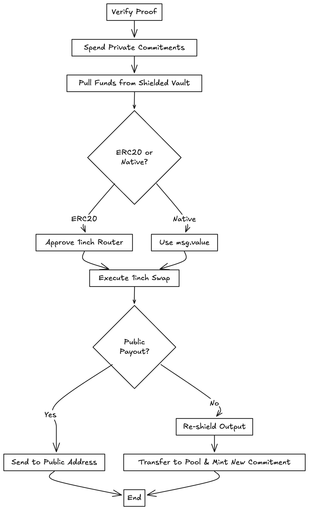

# Swap Flow

This document explains the private token swap process powered by zero-knowledge proofs and the 1inch aggregator.  
The diagram below outlines how funds move from shielded storage through verification, swapping, and output handling.

---

## Process Description

1. **Verify Proof**  
   The SwapExecutor verifies the user’s zero-knowledge proof to ensure ownership and validity of private funds.

2. **Spend Private Commitments**  
   Valid notes are marked as spent (nullifiers used) to prevent reuse.

3. **Pull Funds from Shielded Vault**  
   The executor withdraws the proven swap amount from the shielded vault.

4. **Determine Asset Type**  
   - If **ERC20**, approve the 1inch router.  
   - If **Native**, use `msg.value` for direct transfer.

5. **Execute 1inch Swap**  
   The verified funds are swapped through 1inch using the pre-approved calldata.

6. **Check Payout Mode**  
   - **Public Payout:** Send swapped tokens to a visible address.  
   - **Private Re-shield:** Transfer tokens back to the vault and mint a new commitment for continued privacy.

7. **End**  
   The process concludes either with a public token delivery or a new private balance recorded in the pool.

---

